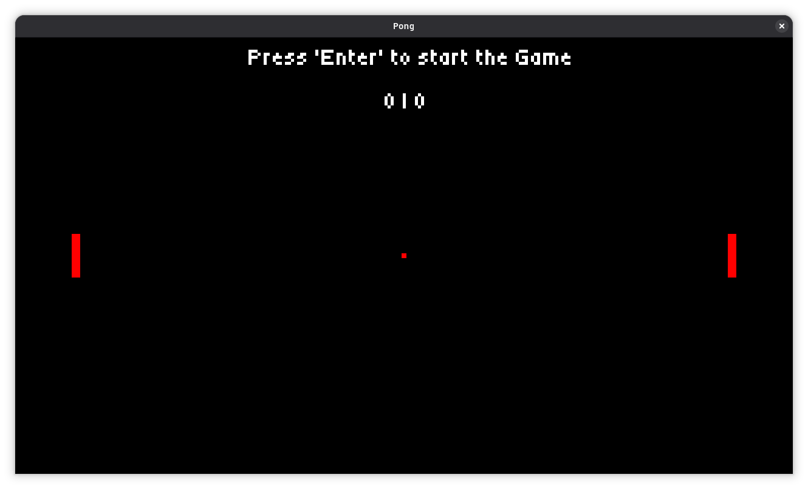

# Pong

This project was developed as part of the [CS50's Introduction to Game Development](https://cs50.harvard.edu/games/) course from Harvard.

The game was built using my own game engine, [SunsetEngine](https://github.com/SunvyWassTaken/SunsetEngine), which is written in C++.

Although the course is designed to be followed using [LÖVE2D](https://love2d.org/) and [Lua](https://www.lua.org/about.html), I decided to implement the project using my own engine instead. This allowed me to follow the concepts taught in the course while also testing and improving SunsetEngine through a practical project.

The goal was not only to recreate Pong, but also to see how well my engine could handle the fundamental systems required to build a simple game.

## How to Play

The first at 10 points __WIN__.

|  Player  |      Key       | Function               |
|:--------:|:--------------:|:-----------------------|
|          |     ENTER      | Start the Game / Serve |
| Player 1 | Z / S or W / S | Move                   |
| Player 2 |   UP / DOWN    | Move                   |
